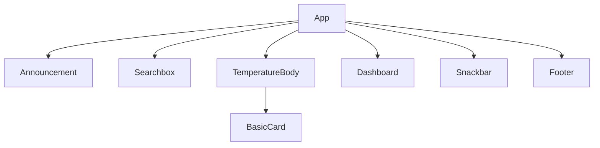

# React Weather App [](https://app.netlify.com/sites/frabjous-dusk-79cc84/deploys)

a weather app created in React. Powered by OpenWeatherMap and Unsplash.

## Description

This is a React-based weather application that leverages the OpenWeatherMap API for fetching weather data and Tailwind CSS for styling.
Additionally, it utilizes Icons8 for weather icons and Unsplash for background images. The source code is later deployed, tested, and hosted on Netlify.

Visit [http://weather-dev.sagelga.com](http://weather-dev.sagelga.com/) to see the app in action.

## Prequisites

-   Node.js version 16.20.0 or higher

## Installation

If you wish to run the app locally, you can clone the repository and run the following commands:

```bash
npm install
npm start
```

but we deployed this project in Netlify. You will have to use the Netlify CLI to run the project locally.

```bash
npm install -g netlify-cli
netlify dev
```

## Components



## APIs

### Open Weather Map API

-   Current Weather Data [https://openweathermap.org/current](https://openweathermap.org/current)
-   5 days Forecast Weather Data [https://openweathermap.org/forecast5](https://openweathermap.org/forecast5)

### Unsplash API

-   Unsplash API [https://unsplash.com/developers](https://unsplash.com/developers)

## Resources

-   React [https://react.dev/learn](https://react.dev/learn)
-   Open Weather Map API [https://openweathermap.org/api](https://openweathermap.org/api)
-   Unsplash API [https://unsplash.com/developers](https://unsplash.com/developers)
-   Icons8 [https://icons8.com/](https://icons8.com/)
-   Tailwind CSS [https://tailwindcss.com/](https://tailwindcss.com/)
-   React Material UI [https://mui.com/](https://mui.com/)
-   Netlify [https://www.netlify.com/](https://www.netlify.com/)
-   Netlify CLI [https://docs.netlify.com/cli/get-started/](https://docs.netlify.com/cli/get-started/)
